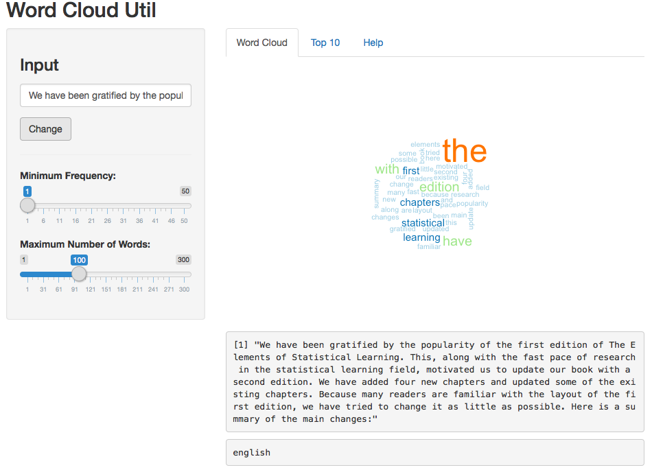

## Word Cloud Util
### Developing Data Products
<br>
<br>
<br>
<br>
<br>
<br>
<br>
<br>
<br>
<br>
<br>
<br>
#### Ricardo Fernandez
December 26th 2015 

---

## Introduction 

**Word Cloud Util** is a simple application for a word count visualization 
and language detection.

The application has been separated in two different columns and three different tabs.
 - Input data column, with three data inputs: 
   - *Text input*: allows to introduce a text or URL.
   - *Minimum frequency of word*: select the minimum frequency of the words displayed in the word cloud
   - *Maximum Number of Words*: select the maximum number of words that will be displayed in the graph.
  
 - Output data column with three different output contexts:
   - *Word Cloud*
   - *Top 10* 
   - *Help*

---

## WordCloud & Language 

The *Word Cloud* tab shows a visual representation of the words that make up a text, where the size is greater for words that appear more frequently.

Is also displayed in this tab a text language detector. By using `textcat` library
detect the main language from the text or URL introduced.



---

## WordCloud & Language 

An example of language detection using the `textcat` library implemented in the project.

Real example from `R` snippet code:
```{r}
library(textcat)
textcat(c("This is an english sentence.",
          "Das ist ein deutscher satz.",
          "Esto es una frase en español",
          "Aquest frase és en català"))
```

---

## Top 10 and Help

#### Top 10

Given the text introduced in the Text Input area the chart shows the top ten 
word selected by frequency.

#### Help

The help tab provides all the information needed to use the application


