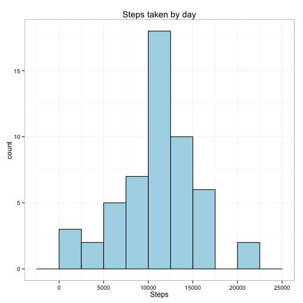
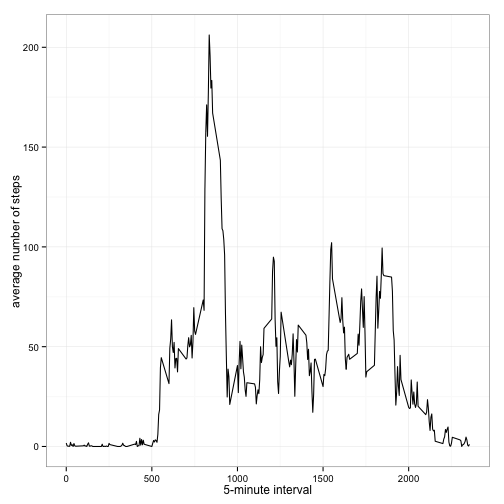
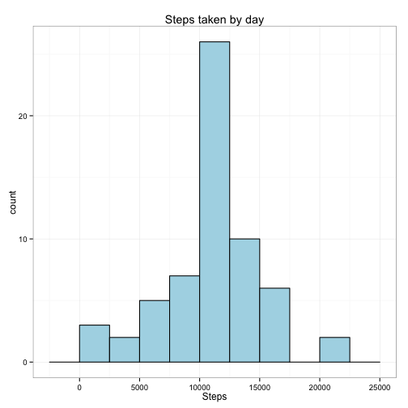
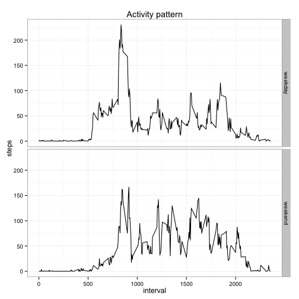

#### Loading and preprocessing the data
First thing we need to do is download the data from the source site

```r
file <- "https://d396qusza40orc.cloudfront.net/repdata%2Fdata%2Factivity.zip"
download.file(file, destfile="./repdata-data-activity.zip")
```

Following will be necessary to unzip the compressed file

```r
unzip("repdata_activity_data.zip")
```

And finally to read the activity data provided inside the file `activity.csv`

```r
activity_rawdata <- read.csv("activity.csv", header = TRUE, sep = ",")
```

Now is time to check the structure of our data, in order to do that we can call the command `str()` 

```r
str(activity_rawdata)
```

```
## 'data.frame':	17568 obs. of  3 variables:
##  $ steps   : int  NA NA NA NA NA NA NA NA NA NA ...
##  $ date    : Factor w/ 61 levels "2012-10-01","2012-10-02",..: 1 1 1 1 1 1 1 1 1 1 ...
##  $ interval: int  0 5 10 15 20 25 30 35 40 45 ...
```

As you can see above, the column date is a factor, now we are going to convert it to Date and remove the NA values

```r
activity_data <- na.omit(activity_rawdata)
activity_data$date <- as.Date(activity_data$date)
```

Now is time to check again the data

```r
str(activity_data)
```

```
## 'data.frame':	15264 obs. of  3 variables:
##  $ steps   : int  0 0 0 0 0 0 0 0 0 0 ...
##  $ date    : Date, format: "2012-10-02" "2012-10-02" ...
##  $ interval: int  0 5 10 15 20 25 30 35 40 45 ...
##  - attr(*, "na.action")=Class 'omit'  Named int [1:2304] 1 2 3 4 5 6 7 8 9 10 ...
##   .. ..- attr(*, "names")= chr [1:2304] "1" "2" "3" "4" ...
```

### What is mean total number of steps taken per day?
In order to answer the question I will use the libraries `ggplot2` and `data.table`

```r
library(ggplot2)
library(data.table)
```

This question is divided in 3 parts:

1. Calculate the total number of steps taken per day
2. Make a histogram of the total number of steps taken each day
3. Calculate and report the mean and median of the total number of steps taken per day

The first thing we are going to do is to calculate the total number of steps taken
per day. In order to accomplish this point the first step will be to convert our
date to `data.table`

```r
activity_datatable <- data.table(activity_data)
```

Calculate the number of steps by day and check with the command `head()`

```r
steps_by_day <- activity_datatable[, list(steps=sum(steps)), by = date,]
head(steps_by_day, n = 5)
```

```
##          date steps
## 1: 2012-10-02   126
## 2: 2012-10-03 11352
## 3: 2012-10-04 12116
## 4: 2012-10-05 13294
## 5: 2012-10-06 15420
```

The second part is to create a histogram, as I mentioned before I will use
`ggplot2`.

```r
ggplot(steps_by_day, aes(x = steps_by_day$steps)) + theme_bw() +
  geom_histogram(binwidth = 2500, fill = I("lightblue"), col=I("black")) +
  labs( title = "Steps taken by day", x = "Steps") 
```

 

Finally we calculate the mean and median of the total number of steps taken per day

```r
mean(steps_by_day$steps)
```

```
## [1] 10766.19
```

```r
median(steps_by_day$steps)
```

```
## [1] 10765
```
The results are a mean of 10766.19 and median of 10765

#### What is the average daily activity pattern?

This question is divided in 2 parts:

1. Make a time series plot of the 5-minute interval and the average number of steps taken, averaged across all days.
2. Which 5-minute interval, on average across all the days in the dataset, contains the maximum number of steps?

First we need to group all the mean by interval and plot the result.

```r
avg_interval <- activity_datatable[, list(steps=mean(steps)), by = interval,]
ggplot(data = avg_interval, aes(x = interval, y = steps)) + geom_line() + theme_bw() + 
  xlab("5-minute interval") + ylab("average number of steps")
```

 

In order to calculate the interval for the highest average step count we use the `which.max()` to find the max steps done and select the interval in `avg_interval`

```r
avg_interval[which.max(avg_interval$steps), ]
```

```
##    interval    steps
## 1:      835 206.1698
```
The highest average steps happened at interval *835*

#### Imputing missing values

This section will be divided in 4 parts:

1.Calculate and report the total number of missing values in the dataset.
2.Devise a strategy for filling in all of the missing values in the dataset.
3.Create a new dataset that is equal to the original dataset but with the missing data filled in.
4.Make a histogram of the total number of steps taken each day and calculate and report the mean and median total number of steps taken per day. Do these values differ from the estimates from the first part of the assignment? What is the impact of imputing missing data on the estimates of the total daily number of steps?


```r
sum(is.na(activity_rawdata$steps))
```

```
## [1] 2304
```

As you can see above there are 2304 missing values. 
Following we continue by filling all the missing values and create a new dataset with the missing values filled with the average values calculated in the previous section. In order to acomplish this section I will look using a for loop the NA values and substitute them for the average.


```r
rawdata_avg <- activity_rawdata
for(i in seq(nrow(rawdata_avg))) {
  if(is.na(rawdata_avg$steps[i])) {
    rawdata_avg$steps[i] <- avg_interval[which(rawdata_avg$interval[i] == avg_interval$interval),]$steps
  }
}
```

With the filled results we can proceed to perform an histogram and calculate the mean and the median.

```r
activity_data_avg_table <- data.table(rawdata_avg)
avg_steps_by_day <- activity_data_avg_table[, list(steps=sum(steps)), by = date,]
ggplot(avg_steps_by_day, aes(x = avg_steps_by_day$steps)) + theme_bw() +
  geom_histogram(binwidth = 2500, fill = I("lightblue"), col=I("black")) +
  labs( title = "Steps taken by day", x = "Steps") 
```

 

Finally we calculate the mean and median of the total number of steps taken per day as we have done in the previous section

```r
mean(avg_steps_by_day$steps)
```

```
## [1] 10766.19
```

```r
median(avg_steps_by_day$steps)
```

```
## [1] 10766.19
```

The results are a mean of 10766.19 and median of 10765. 
If we compare the mean from the first part, without the average values, and the
mean of the secong part, with the average values we can see that they have the 
same value 10766.19 both. However the median is not, for the first part the
median was 10765 and for de second part 10766.19. This is is because we 
introduced values closer to the mean, all NA were changed by and average, which
in fact is cleary close to the mean, this also explains why the mean and median 
for this second part are so close.

#### Are there differences in activity patterns between weekdays and weekends?

1. Create a new factor variable in the dataset with two levels <U+201C>weekday<U+201D> and <U+201C>weekend<U+201D> indicating whether a given date is a weekday or weekend day.

2. Make a panel plot containing a time series plot (i.e. type = "l") of the 5-minute interval (x-axis) and the average number of steps taken, averaged across all weekday days or weekend days (y-axis). See the README file in the GitHub repository to see an example of what this plot should look like using simulated data.


```r
rawdata_avg$date <- as.Date(rawdata_avg$date)
week_days <- factor(weekdays(rawdata_avg$date) %in% c("Saturday","Sunday"), 
                    labels=c("weekday","weekend"), ordered=FALSE)

agr_data <- aggregate(rawdata_avg$steps, by=list(interval=rawdata_avg$interval, 
                                                 weekday=week_days), mean)
```


```r
ggplot(agr_data, aes(x=interval, y=x, group=weekday)) + theme_bw() +
  geom_line() + facet_grid(weekday ~ .) + labs(y="steps") + labs(x="interval") +
  labs(title="Activity pattern")
```

 

